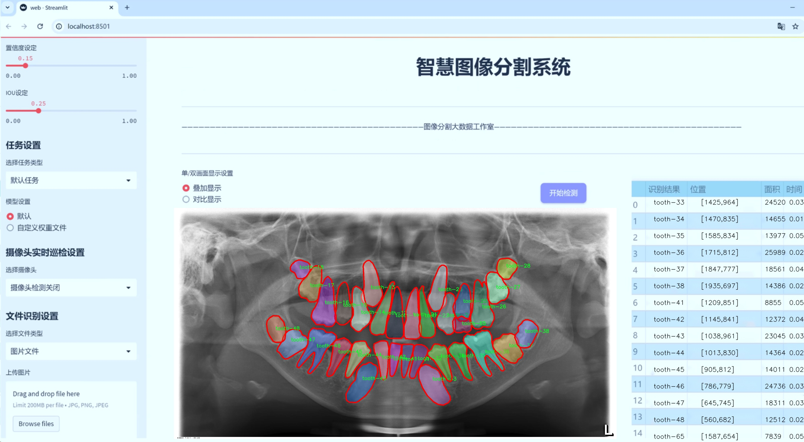

# 牙片牙齿图像分割系统源码＆数据集分享
 [yolov8-seg-C2f-ODConv＆yolov8-seg-EfficientRepBiPAN等50+全套改进创新点发刊_一键训练教程_Web前端展示]

### 1.研究背景与意义

项目参考[ILSVRC ImageNet Large Scale Visual Recognition Challenge](https://gitee.com/YOLOv8_YOLOv11_Segmentation_Studio/projects)

项目来源[AAAI Global Al lnnovation Contest](https://kdocs.cn/l/cszuIiCKVNis)

研究背景与意义

随着人工智能技术的迅猛发展，计算机视觉在医疗领域的应用日益广泛，尤其是在牙科图像处理方面。牙齿健康不仅影响个体的生理状态，还与整体健康密切相关。因此，开发高效的牙齿图像分割系统，对于牙科诊断、治疗计划及后续监测具有重要的现实意义。传统的牙齿图像分析方法往往依赖于人工标注和经验判断，效率低下且容易受到主观因素的影响。而基于深度学习的图像分割技术，尤其是YOLO（You Only Look Once）系列模型，因其高效的实时检测能力和较高的准确性，逐渐成为牙科图像分析的研究热点。

本研究旨在基于改进的YOLOv8模型，构建一个高效的牙片牙齿图像分割系统。我们使用的Odontoai数据集包含2000张牙齿图像，涵盖52个类别，具体包括从牙齿11到牙齿85的不同类型。这一丰富的类别设置为模型的训练提供了充分的数据支持，使其能够在多样化的牙齿图像中进行准确的分割和识别。通过对不同类别牙齿的精确分割，能够为后续的牙科诊断提供更为细致的依据，进而提高临床治疗的精准度。

在牙科领域，牙齿的健康状况往往需要通过影像学检查来评估。传统的影像分析方法不仅耗时，而且容易出现误判。借助深度学习技术，尤其是YOLOv8的实时检测能力，可以大幅提升牙齿图像分析的效率和准确性。YOLOv8模型在特征提取和处理速度方面的优势，使其能够在复杂的牙齿图像中快速识别并分割出不同的牙齿类型，进而为牙科医生提供直观的视觉信息支持。

此外，改进YOLOv8模型的研究意义还在于其可推广性。通过对牙齿图像分割的深入研究，可以为其他医疗影像分析领域提供借鉴，推动相关技术的进步。随着数据集的不断丰富和模型的不断优化，未来有望实现更高精度的牙齿图像分析，甚至可以拓展到口腔疾病的早期筛查和预警。

综上所述，基于改进YOLOv8的牙片牙齿图像分割系统的研究，不仅具有重要的学术价值，也具备显著的临床应用前景。通过提升牙齿图像分割的效率和准确性，将为牙科医生提供更为可靠的决策支持，进而推动牙科医疗服务的智能化和精准化发展。这一研究不仅是对现有技术的延续和发展，更是对未来牙科影像分析技术的积极探索，为实现更高水平的医疗服务贡献力量。

### 2.图片演示




##### 注意：由于此博客编辑较早，上面“2.图片演示”和“3.视频演示”展示的系统图片或者视频可能为老版本，新版本在老版本的基础上升级如下：（实际效果以升级的新版本为准）

  （1）适配了YOLOV8的“目标检测”模型和“实例分割”模型，通过加载相应的权重（.pt）文件即可自适应加载模型。

  （2）支持“图片识别”、“视频识别”、“摄像头实时识别”三种识别模式。

  （3）支持“图片识别”、“视频识别”、“摄像头实时识别”三种识别结果保存导出，解决手动导出（容易卡顿出现爆内存）存在的问题，识别完自动保存结果并导出到tempDir中。

  （4）支持Web前端系统中的标题、背景图等自定义修改，后面提供修改教程。

  另外本项目提供训练的数据集和训练教程,暂不提供权重文件（best.pt）,需要您按照教程进行训练后实现图片演示和Web前端界面演示的效果。

### 3.视频演示

[3.1 视频演示](https://www.bilibili.com/video/BV1QEy3YvEK3/)

### 4.数据集信息展示

##### 4.1 本项目数据集详细数据（类别数＆类别名）

nc: 52
names: ['tooth-11', 'tooth-12', 'tooth-13', 'tooth-14', 'tooth-15', 'tooth-16', 'tooth-17', 'tooth-18', 'tooth-21', 'tooth-22', 'tooth-23', 'tooth-24', 'tooth-25', 'tooth-26', 'tooth-27', 'tooth-28', 'tooth-31', 'tooth-32', 'tooth-33', 'tooth-34', 'tooth-35', 'tooth-36', 'tooth-37', 'tooth-38', 'tooth-41', 'tooth-42', 'tooth-43', 'tooth-44', 'tooth-45', 'tooth-46', 'tooth-47', 'tooth-48', 'tooth-51', 'tooth-52', 'tooth-53', 'tooth-54', 'tooth-55', 'tooth-61', 'tooth-62', 'tooth-63', 'tooth-64', 'tooth-65', 'tooth-71', 'tooth-72', 'tooth-73', 'tooth-74', 'tooth-75', 'tooth-81', 'tooth-82', 'tooth-83', 'tooth-84', 'tooth-85']


##### 4.2 本项目数据集信息介绍

数据集信息展示

在本研究中，我们采用了名为“Odontoai”的数据集，以训练和改进YOLOv8-seg模型，旨在实现牙片牙齿图像的高效分割。该数据集的独特之处在于其涵盖了52个不同类别的牙齿，能够为模型提供丰富的训练样本，从而提升其在实际应用中的表现。每个类别代表了特定类型的牙齿，具体包括从牙齿11到牙齿85的多个编号，这些编号不仅具有科学性，还为牙科专业人员提供了便于识别和分类的标准。

“Odontoai”数据集的类别名称包括：tooth-11、tooth-12、tooth-13、tooth-14、tooth-15、tooth-16、tooth-17、tooth-18、tooth-21、tooth-22、tooth-23、tooth-24、tooth-25、tooth-26、tooth-27、tooth-28、tooth-31、tooth-32、tooth-33、tooth-34、tooth-35、tooth-36、tooth-37、tooth-38、tooth-41、tooth-42、tooth-43、tooth-44、tooth-45、tooth-46、tooth-47、tooth-48、tooth-51、tooth-52、tooth-53、tooth-54、tooth-55、tooth-61、tooth-62、tooth-63、tooth-64、tooth-65、tooth-71、tooth-72、tooth-73、tooth-74、tooth-75、tooth-81、tooth-82、tooth-83、tooth-84、tooth-85。这些类别的多样性使得模型在学习过程中能够接触到不同形态和结构的牙齿，进而提高其对复杂场景的适应能力。

数据集的构建过程经过严格的标准化和标注，确保每个图像都经过专业牙科医生的审核，标注的准确性和一致性得到了保障。这种高质量的标注为模型的训练提供了坚实的基础，使得YOLOv8-seg在牙齿图像分割任务中能够更好地理解和识别不同类型的牙齿结构。此外，数据集中的图像样本涵盖了多种拍摄角度、光照条件和背景环境，进一步增强了模型的泛化能力。

在数据集的使用过程中，我们将其划分为训练集、验证集和测试集，以便于模型的训练和评估。训练集用于模型的学习，验证集用于调整模型参数，测试集则用于最终的性能评估。通过这种方式，我们能够全面评估模型在不同条件下的表现，确保其在实际应用中的可靠性和有效性。

总之，“Odontoai”数据集不仅为改进YOLOv8-seg模型提供了丰富的训练素材，也为牙科图像处理领域的研究提供了重要的数据支持。通过对该数据集的深入分析和应用，我们期望能够推动牙齿图像分割技术的发展，为临床诊断和治疗提供更为精准的辅助工具。随着研究的深入，我们相信这一数据集将为未来的相关研究提供宝贵的参考和借鉴。


### 5.全套项目环境部署视频教程（零基础手把手教学）

[5.1 环境部署教程链接（零基础手把手教学）](https://www.bilibili.com/video/BV1jG4Ve4E9t/?vd_source=bc9aec86d164b67a7004b996143742dc)


[5.2 安装Python虚拟环境创建和依赖库安装视频教程链接（零基础手把手教学）](https://www.bilibili.com/video/BV1nA4VeYEze/?vd_source=bc9aec86d164b67a7004b996143742dc)

### 6.手把手YOLOV8-seg训练视频教程（零基础小白有手就能学会）

[6.1 手把手YOLOV8-seg训练视频教程（零基础小白有手就能学会）](https://www.bilibili.com/video/BV1cA4VeYETe/?vd_source=bc9aec86d164b67a7004b996143742dc)


按照上面的训练视频教程链接加载项目提供的数据集，运行train.py即可开始训练



     Epoch   gpu_mem       box       obj       cls    labels  img_size
     1/200     0G   0.01576   0.01955  0.007536        22      1280: 100%|██████████| 849/849 [14:42<00:00,  1.04s/it]
               Class     Images     Labels          P          R     mAP@.5 mAP@.5:.95: 100%|██████████| 213/213 [01:14<00:00,  2.87it/s]
                 all       3395      17314      0.994      0.957      0.0957      0.0843

     Epoch   gpu_mem       box       obj       cls    labels  img_size
     2/200     0G   0.01578   0.01923  0.007006        22      1280: 100%|██████████| 849/849 [14:44<00:00,  1.04s/it]
               Class     Images     Labels          P          R     mAP@.5 mAP@.5:.95: 100%|██████████| 213/213 [01:12<00:00,  2.95it/s]
                 all       3395      17314      0.996      0.956      0.0957      0.0845

     Epoch   gpu_mem       box       obj       cls    labels  img_size
     3/200     0G   0.01561    0.0191  0.006895        27      1280: 100%|██████████| 849/849 [10:56<00:00,  1.29it/s]
               Class     Images     Labels          P          R     mAP@.5 mAP@.5:.95: 100%|███████   | 187/213 [00:52<00:00,  4.04it/s]
                 all       3395      17314      0.996      0.957      0.0957      0.0845


### 7.50+种全套YOLOV8-seg创新点代码加载调参视频教程（一键加载写好的改进模型的配置文件）

[7.1 50+种全套YOLOV8-seg创新点代码加载调参视频教程（一键加载写好的改进模型的配置文件）](https://www.bilibili.com/video/BV1Hw4VePEXv/?vd_source=bc9aec86d164b67a7004b996143742dc)

### 8.YOLOV8-seg图像分割算法原理

原始YOLOV8-seg算法原理

YOLO（You Only Look Once）系列算法自其首次提出以来，便以其高效的目标检测能力而广受关注。YOLOv8作为该系列的最新版本，进一步优化了检测精度和速度，特别是在处理复杂场景和多尺度目标时展现出了显著的优势。YOLOv8-seg算法不仅继承了YOLO系列的核心思想，还在此基础上引入了分割功能，使得其在目标检测的同时，能够实现对目标的精确分割，从而在计算机视觉领域中提供了更为丰富的信息。

YOLOv8的网络结构由四个主要部分组成：输入模块、Backbone骨干网络、Neck特征融合网络和Head检测模块。输入模块负责对输入图像进行预处理，包括图像比例调整、Mosaic增强和瞄点计算等操作。这些预处理步骤旨在提升模型对不同场景的适应能力，确保后续特征提取的有效性。

在Backbone部分，YOLOv8采用了改进的DarkNet结构，使用C2f模块替代了传统的C3模块。C2f模块的引入不仅提高了特征提取的效率，还优化了梯度流动，使得网络在训练过程中能够更好地保留信息。通过对不同尺度模型的通道数进行调整，YOLOv8能够获取更为丰富的特征信息，这对于后续的目标检测和分割任务至关重要。

特征融合网络Neck部分则采用了“双塔结构”，结合了特征金字塔网络（FPN）和路径聚合网络（PAN）。这种结构的设计旨在促进语义特征和定位特征之间的有效转移，从而增强网络对不同尺度目标的检测能力。通过对特征图的多层次融合，YOLOv8能够在处理复杂场景时，保持较高的检测精度。

在Head检测模块中，YOLOv8引入了解耦头的结构，将分类和回归任务分离为两个独立的分支。这一设计使得模型在处理复杂场景时，能够更专注于各自的任务，减少了因任务耦合导致的定位不准和分类错误的问题。此外，YOLOv8采用了Anchor-free的目标检测方法，直接通过回归方式预测目标的位置和大小，避免了传统方法中锚点框选择和调整的繁琐。这种方法使得网络能够更快地聚焦于目标位置的邻近点，从而提高了预测框的准确性。

在YOLOv8-seg算法中，分割功能的引入为目标检测提供了更为细致的信息。通过对目标的像素级分割，YOLOv8-seg能够在复杂场景中有效区分不同目标，甚至在目标之间存在重叠的情况下，依然能够实现准确的分割。这一特性使得YOLOv8-seg在自动驾驶、医学影像分析等领域具有广泛的应用潜力。

YOLOv8-seg的训练过程同样经过了精心设计，以确保模型在不同数据集上的泛化能力。通过数据增强技术，如随机裁剪、旋转、翻转等，模型能够在多样化的训练数据中学习到更为鲁棒的特征。此外，YOLOv8-seg还引入了多任务学习的策略，在训练过程中同时优化检测和分割任务，从而提高了模型的整体性能。

总的来说，YOLOv8-seg算法通过一系列创新的设计和优化，不仅在目标检测的速度和精度上达到了新的高度，同时也在目标分割任务中展现出了强大的能力。其独特的网络结构和高效的训练策略，使得YOLOv8-seg成为了当前计算机视觉领域中一款极具竞争力的算法。随着技术的不断进步，YOLOv8-seg有望在更多实际应用中发挥重要作用，为智能视觉系统的发展提供强有力的支持。


### 9.系统功能展示（检测对象为举例，实际内容以本项目数据集为准）

图9.1.系统支持检测结果表格显示

  图9.2.系统支持置信度和IOU阈值手动调节

  图9.3.系统支持自定义加载权重文件best.pt(需要你通过步骤5中训练获得)

  图9.4.系统支持摄像头实时识别

  图9.5.系统支持图片识别

  图9.6.系统支持视频识别

  图9.7.系统支持识别结果文件自动保存

  图9.8.系统支持Excel导出检测结果数据


### 10.50+种全套YOLOV8-seg创新点原理讲解（非科班也可以轻松写刊发刊，V11版本正在科研待更新）

#### 10.1 由于篇幅限制，每个创新点的具体原理讲解就不一一展开，具体见下列网址中的创新点对应子项目的技术原理博客网址【Blog】：


[10.1 50+种全套YOLOV8-seg创新点原理讲解链接](https://gitee.com/qunmasj/good)

#### 10.2 部分改进模块原理讲解(完整的改进原理见上图和技术博客链接)【如果此小节的图加载失败可以通过CSDN或者Github搜索该博客的标题访问原始博客，原始博客图片显示正常】
### YOLOv8算法原理
YOLOv8算法由Glenn-Jocher 提出，是跟YOLOv3算法、YOLOv5算法一脉相承的，主要的改进点如下:
(1)数据预处理。YOLOv8的数据预处理依旧采用YOLOv5的策略,在训练时，主要采用包括马赛克增强(Mosaic)、混合增强(Mixup)、空间扰动(randomperspective)以及颜色扰动(HSV augment)四个增强手段。
(2)骨干网络结构。YOLOv8的骨干网络结构可从YOLOv5略见一斑，YOLOv5的主干网络的架构规律十分清晰，总体来看就是每用一层步长为2的3×3卷积去降采样特征图，接一个C3模块来进一步强化其中的特征，且C3的基本深度参数分别为“3/6/9/3”，其会根据不同规模的模型的来做相应的缩放。在的YOLOv8中，大体上也还是继承了这一特点，原先的C3模块均被替换成了新的C2f模块，C2f 模块加入更多的分支，丰富梯度回传时的支流。下面展示了YOLOv8的C2f模块和YOLOv5的C3模块，其网络结构图所示。


(3)FPN-PAN结构。YOLOv8仍采用FPN+PAN结构来构建YOLO的特征金字塔，使多尺度信息之间进行充分的融合。除了FPN-PAN里面的C3模块被替换为C2f模块外，其余部分与YOLOv5的FPN-PAN结构基本一致。
(4)Detection head结构。从 YOLOv3到 YOLOv5，其检测头一直都是“耦合”(Coupled)的,即使用一层卷积同时完成分类和定位两个任务，直到YOLOX的问世， YOLO系列才第一次换装“解耦头”(Decoupled Head)。YOLOv8也同样也采用了解耦头的结构，两条并行的分支分别取提取类别特征和位置特征，然后各用一层1x1卷积完成分类和定位任务。YOLOv8整体的网络结构由图所示。


(5)标签分配策略。尽管YOLOv5设计了自动聚类候选框的一些功能，但是聚类候选框是依赖于数据集的。若数据集不够充分，无法较为准确地反映数据本身的分布特征，聚类出来的候选框也会与真实物体尺寸比例悬殊过大。YOLOv8没有采用候选框策略，所以解决的问题就是正负样本匹配的多尺度分配。不同于YOLOX所使用的 SimOTA，YOLOv8在标签分配问题上采用了和YOLOv6相同的TOOD策略，是一种动态标签分配策略。YOLOv8只用到了targetboze。和target scores，未含是否有物体预测，故 YOLOv8的损失就主要包括两大部分∶类别损失和位置损失。对于YOLOv8，其分类损失为VFLLoss(Varifocal Loss)，其回归损失为CIoU Loss 与 DFL Loss 的形式。
其中 Varifocal Loss定义如下:


其中p为预测的类别得分，p ∈ [0.1]。q为预测的目标分数(若为真实类别，则q为预测和真值的 loU;若为其他类别。q为0 )。VFL Loss使用不对称参数来对正负样本进行加权，通过只对负样本进行衰减，达到不对等的处理前景和背景对损失的贡献。对正样本，使用q进行了加权，如果正样本的GTiou很高时,则对损失的贡献更大一些，可以让网络聚焦于那些高质量的样本上，即训练高质量的正例对AP的提升比低质量的更大一些。对负样本，使用p进行了降权，降低了负例对损失的贡献，因负样本的预测p在取次幂后会变得更小，这样就能够降低负样本对损失的整体贡献。

### 动态蛇形卷积Dynamic Snake Convolution

参考论文： 2307.08388.pdf (arxiv.org)

血管、道路等拓扑管状结构的精确分割在各个领域都至关重要，确保下游任务的准确性和效率。 然而，许多因素使任务变得复杂，包括薄的局部结构和可变的全局形态。在这项工作中，我们注意到管状结构的特殊性，并利用这些知识来指导我们的 DSCNet 在三个阶段同时增强感知：特征提取、特征融合、 和损失约束。 首先，我们提出了一种动态蛇卷积，通过自适应地关注细长和曲折的局部结构来准确捕获管状结构的特征。 随后，我们提出了一种多视图特征融合策略，以补充特征融合过程中多角度对特征的关注，确保保留来自不同全局形态的重要信息。 最后，提出了一种基于持久同源性的连续性约束损失函数，以更好地约束分割的拓扑连续性。 2D 和 3D 数据集上的实验表明，与多种方法相比，我们的 DSCNet 在管状结构分割任务上提供了更好的准确性和连续性。 我们的代码是公开的。 
主要的挑战源于细长微弱的局部结构特征与复杂多变的全局形态特征。本文关注到管状结构细长连续的特点，并利用这一信息在神经网络以下三个阶段同时增强感知：特征提取、特征融合和损失约束。分别设计了动态蛇形卷积（Dynamic Snake Convolution），多视角特征融合策略与连续性拓扑约束损失。 

我们希望卷积核一方面能够自由地贴合结构学习特征，另一方面能够在约束条件下不偏离目标结构太远。在观察管状结构的细长连续的特征后，脑海里想到了一个动物——蛇。我们希望卷积核能够像蛇一样动态地扭动，来贴合目标的结构。

我们希望卷积核一方面能够自由地贴合结构学习特征，另一方面能够在约束条件下不偏离目标结构太远。在观察管状结构的细长连续的特征后，脑海里想到了一个动物——蛇。我们希望卷积核能够像蛇一样动态地扭动，来贴合目标的结构。


### DCNV2融入YOLOv8
DCN和DCNv2（可变性卷积）
网上关于两篇文章的详细描述已经很多了，我这里具体的细节就不多讲了，只说一下其中实现起来比较困惑的点。（黑体字会讲解）

DCNv1解决的问题就是我们常规的图像增强，仿射变换（线性变换加平移）不能解决的多种形式目标变换的几何变换的问题。如下图所示。

可变性卷积的思想很简单，就是讲原来固定形状的卷积核变成可变的。如下图所示：


首先来看普通卷积，以3x3卷积为例对于每个输出y(p0)，都要从x上采样9个位置，这9个位置都在中心位置x(p0)向四周扩散得到的gird形状上，(-1,-1)代表x(p0)的左上角，(1,1)代表x(p0)的右下角，其他类似。

用公式表示如下：


可变性卷积Deformable Conv操作并没有改变卷积的计算操作，而是在卷积操作的作用区域上，加入了一个可学习的参数∆pn。同样对于每个输出y(p0)，都要从x上采样9个位置，这9个位置是中心位置x(p0)向四周扩散得到的，但是多了 ∆pn，允许采样点扩散成非gird形状。


偏移量是通过对原始特征层进行卷积得到的。比如输入特征层是w×h×c，先对输入的特征层进行卷积操作，得到w×h×2c的offset field。这里的w和h和原始特征层的w和h是一致的，offset field里面的值是输入特征层对应位置的偏移量，偏移量有x和y两个方向，所以offset field的channel数是2c。offset field里的偏移量是卷积得到的，可能是浮点数，所以接下来需要通过双向性插值计算偏移位置的特征值。在偏移量的学习中，梯度是通过双线性插值来进行反向传播的。
看到这里是不是还是有点迷茫呢？那到底程序上面怎么实现呢？


事实上由上面的公式我们可以看得出来∆pn这个偏移量是加在原像素点上的，但是我们怎么样从代码上对原像素点加这个量呢？其实很简单，就是用一个普通的卷积核去跟输入图片（一般是输入的feature_map）卷积就可以了卷积核的数量是2N也就是23*3==18（前9个通道是x方向的偏移量，后9个是y方向的偏移量），然后把这个卷积的结果与正常卷积的结果进行相加就可以了。
然后又有了第二个问题，怎么样反向传播呢？为什么会有这个问题呢？因为求出来的偏移量+正常卷积输出的结果往往是一个浮点数，浮点数是无法对应到原图的像素点的，所以自然就想到了双线性差值的方法求出浮点数对应的浮点像素点。


#### DCN v2
对于positive的样本来说，采样的特征应该focus在RoI内，如果特征中包含了过多超出RoI的内容，那么结果会受到影响和干扰。而negative样本则恰恰相反，引入一些超出RoI的特征有助于帮助网络判别这个区域是背景区域。

DCNv1引入了可变形卷积，能更好的适应目标的几何变换。但是v1可视化结果显示其感受野对应位置超出了目标范围，导致特征不受图像内容影响（理想情况是所有的对应位置分布在目标范围以内）。

为了解决该问题：提出v2, 主要有

1、扩展可变形卷积，增强建模能力
2、提出了特征模拟方案指导网络培训：feature mimicking scheme

上面这段话是什么意思呢，通俗来讲就是，我们的可变性卷积的区域大于目标所在区域，所以这时候就会对非目标区域进行错误识别。

所以自然能想到的解决方案就是加入权重项进行惩罚。（至于这个实现起来就比较简单了，直接初始化一个权重然后乘(input+offsets)就可以了）


可调节的RoIpooling也是类似的，公式如下：


### 11.项目核心源码讲解（再也不用担心看不懂代码逻辑）

#### 11.1 ultralytics\models\sam\modules\tiny_encoder.py

以下是对TinyViT模型核心部分的提炼和详细中文注释：

```python
import torch
import torch.nn as nn
import torch.nn.functional as F

class Conv2d_BN(torch.nn.Sequential):
    """执行2D卷积操作，后接批量归一化的顺序容器。"""

    def __init__(self, in_channels, out_channels, kernel_size=1, stride=1, padding=0, dilation=1, groups=1, bn_weight_init=1):
        """初始化卷积层和批量归一化层。"""
        super().__init__()
        # 添加卷积层
        self.add_module('c', torch.nn.Conv2d(in_channels, out_channels, kernel_size, stride, padding, dilation, groups, bias=False))
        # 添加批量归一化层
        bn = torch.nn.BatchNorm2d(out_channels)
        torch.nn.init.constant_(bn.weight, bn_weight_init)  # 初始化权重
        torch.nn.init.constant_(bn.bias, 0)  # 初始化偏置
        self.add_module('bn', bn)

class PatchEmbed(nn.Module):
    """将图像嵌入为补丁并投影到指定的嵌入维度。"""

    def __init__(self, in_chans, embed_dim, resolution, activation):
        """初始化PatchEmbed类。"""
        super().__init__()
        img_size = (resolution, resolution)  # 假设输入为正方形图像
        self.patches_resolution = (img_size[0] // 4, img_size[1] // 4)  # 计算补丁分辨率
        self.num_patches = self.patches_resolution[0] * self.patches_resolution[1]  # 计算补丁数量
        self.in_chans = in_chans
        self.embed_dim = embed_dim
        n = embed_dim
        # 定义卷积和激活的顺序
        self.seq = nn.Sequential(
            Conv2d_BN(in_chans, n // 2, 3, 2, 1),  # 第一个卷积层
            activation(),  # 激活函数
            Conv2d_BN(n // 2, n, 3, 2, 1),  # 第二个卷积层
        )

    def forward(self, x):
        """将输入张量通过PatchEmbed的序列操作。"""
        return self.seq(x)

class MBConv(nn.Module):
    """移动反向瓶颈卷积（MBConv）层，EfficientNet架构的一部分。"""

    def __init__(self, in_chans, out_chans, expand_ratio, activation):
        """初始化MBConv层。"""
        super().__init__()
        self.in_chans = in_chans
        self.hidden_chans = int(in_chans * expand_ratio)  # 计算隐藏通道数
        self.out_chans = out_chans

        # 定义卷积层和激活函数
        self.conv1 = Conv2d_BN(in_chans, self.hidden_chans, ks=1)
        self.act1 = activation()
        self.conv2 = Conv2d_BN(self.hidden_chans, self.hidden_chans, ks=3, stride=1, pad=1, groups=self.hidden_chans)
        self.act2 = activation()
        self.conv3 = Conv2d_BN(self.hidden_chans, out_chans, ks=1, bn_weight_init=0.0)
        self.act3 = activation()

    def forward(self, x):
        """实现模型架构的前向传播。"""
        shortcut = x  # 残差连接
        x = self.conv1(x)
        x = self.act1(x)
        x = self.conv2(x)
        x = self.act2(x)
        x = self.conv3(x)
        x += shortcut  # 残差连接
        return self.act3(x)

class Attention(nn.Module):
    """多头注意力模块，支持空间感知。"""

    def __init__(self, dim, key_dim, num_heads=8):
        """初始化注意力模块。"""
        super().__init__()
        self.num_heads = num_heads
        self.scale = key_dim ** -0.5  # 缩放因子
        self.qkv = nn.Linear(dim, dim * 3)  # 查询、键、值的线性变换
        self.proj = nn.Linear(dim, dim)  # 输出线性变换

    def forward(self, x):
        """执行前向传播，计算注意力。"""
        B, N, _ = x.shape  # 获取输入的批量大小和序列长度
        qkv = self.qkv(x).reshape(B, N, 3, self.num_heads, -1).permute(2, 0, 3, 1, 4)  # 计算q、k、v
        q, k, v = qkv[0], qkv[1], qkv[2]  # 分离q、k、v
        attn = (q @ k.transpose(-2, -1)) * self.scale  # 计算注意力得分
        attn = attn.softmax(dim=-1)  # 归一化
        x = (attn @ v).transpose(1, 2).reshape(B, N, -1)  # 计算加权和
        return self.proj(x)  # 输出

class TinyViT(nn.Module):
    """TinyViT架构，用于视觉任务。"""

    def __init__(self, img_size=224, in_chans=3, num_classes=1000, embed_dims=[96, 192, 384, 768], depths=[2, 2, 6, 2], num_heads=[3, 6, 12, 24]):
        """初始化TinyViT模型。"""
        super().__init__()
        self.patch_embed = PatchEmbed(in_chans=in_chans, embed_dim=embed_dims[0], resolution=img_size, activation=nn.GELU)
        self.layers = nn.ModuleList()  # 存储每一层

        # 构建每一层
        for i_layer in range(len(depths)):
            layer = BasicLayer(dim=embed_dims[i_layer], depth=depths[i_layer], num_heads=num_heads[i_layer])
            self.layers.append(layer)

        self.head = nn.Linear(embed_dims[-1], num_classes) if num_classes > 0 else nn.Identity()  # 分类头

    def forward(self, x):
        """执行前向传播，返回模型输出。"""
        x = self.patch_embed(x)  # 嵌入补丁
        for layer in self.layers:
            x = layer(x)  # 通过每一层
        return self.head(x)  # 通过分类头
```

### 代码核心部分解释：
1. **Conv2d_BN**: 该类定义了一个卷积层，后接批量归一化，常用于特征提取。
2. **PatchEmbed**: 将输入图像分割成补丁并映射到嵌入空间，主要用于图像预处理。
3. **MBConv**: 实现了移动反向瓶颈卷积，能够有效提取特征并保持计算效率。
4. **Attention**: 实现了多头注意力机制，允许模型在不同的特征子空间中进行学习。
5. **TinyViT**: 整个模型的核心类，负责将输入图像通过补丁嵌入、多个层和最终的分类头进行处理，输出分类结果。

这些类和方法构成了TinyViT模型的基础，能够处理视觉任务并进行有效的特征提取和分类。

该文件定义了一个名为 `TinyViT` 的深度学习模型架构，主要用于计算机视觉任务。该模型的设计灵感来源于 EfficientNet 和 Transformer 架构，结合了卷积神经网络和自注意力机制，以提高模型的性能和效率。

文件首先导入了必要的库，包括 PyTorch 的核心模块和一些工具函数。接着，定义了一系列的类，每个类代表模型中的一个组成部分。

`Conv2d_BN` 类是一个简单的卷积层，后接批量归一化。它的构造函数接受多个参数，包括输入通道数、输出通道数、卷积核大小、步幅等。这个类在模型中被多次使用，以实现卷积操作和归一化。

`PatchEmbed` 类负责将输入图像分割成小块（patches），并将这些小块投影到指定的嵌入维度。该类的构造函数中定义了两个卷积层，用于处理输入图像并生成嵌入表示。

`MBConv` 类实现了移动反向瓶颈卷积层，这是 EfficientNet 中的一个重要组成部分。该类通过一系列卷积和激活函数的组合来构建层，并使用残差连接来增强模型的学习能力。

`PatchMerging` 类则负责将相邻的特征块合并，并将其投影到新的维度，以便在模型的不同层之间进行信息传递。

`ConvLayer` 类是一个包含多个 MBConv 层的卷积层，支持下采样和梯度检查点功能，以节省内存。

`Mlp` 类实现了多层感知机（MLP），用于在 Transformer 架构中进行特征变换。

`Attention` 类实现了多头自注意力机制，支持空间意识，通过计算空间位置之间的注意力偏置来增强模型的表达能力。

`TinyViTBlock` 类结合了自注意力和局部卷积的功能，形成了 TinyViT 模型的基本构建块。

`BasicLayer` 类则表示 TinyViT 模型中的一个基本层，包含多个 TinyViTBlock。

`LayerNorm2d` 类实现了二维层归一化，用于对特征图进行归一化处理。

最后，`TinyViT` 类是整个模型的核心，负责将所有的层组合在一起。它的构造函数接受多个参数，以定义模型的结构，包括输入图像大小、输入通道数、分类类别数、每层的嵌入维度、深度、注意力头数等。模型的前向传播方法 `forward` 通过逐层处理输入数据，最终输出分类结果。

总的来说，该文件实现了一个灵活且高效的视觉模型 TinyViT，能够处理多种计算机视觉任务，并且通过多种设计策略（如残差连接、层归一化和自注意力机制）来提高模型的性能。

#### 11.2 ui.py

以下是保留的核心代码部分，并附上详细的中文注释：

```python
import sys
import subprocess

def run_script(script_path):
    """
    使用当前 Python 环境运行指定的脚本。

    Args:
        script_path (str): 要运行的脚本路径

    Returns:
        None
    """
    # 获取当前 Python 解释器的路径
    python_path = sys.executable

    # 构建运行命令，使用 streamlit 运行指定的脚本
    command = f'"{python_path}" -m streamlit run "{script_path}"'

    # 执行命令，并等待其完成
    result = subprocess.run(command, shell=True)
    
    # 检查命令执行的返回码，如果不为0则表示出错
    if result.returncode != 0:
        print("脚本运行出错。")

# 实例化并运行应用
if __name__ == "__main__":
    # 指定要运行的脚本路径
    script_path = "web.py"  # 假设脚本在当前目录下

    # 调用函数运行脚本
    run_script(script_path)
```

### 代码注释说明：
1. **导入模块**：
   - `sys`：用于获取当前 Python 解释器的路径。
   - `subprocess`：用于执行外部命令。

2. **定义 `run_script` 函数**：
   - 该函数接收一个脚本路径作为参数，并使用当前 Python 环境运行该脚本。
   - 使用 `sys.executable` 获取当前 Python 解释器的路径。
   - 构建一个命令字符串，使用 `streamlit` 模块运行指定的脚本。
   - 使用 `subprocess.run` 执行构建的命令，并等待其完成。
   - 检查命令的返回码，如果返回码不为0，表示脚本运行出错，并打印错误信息。

3. **主程序块**：
   - 当脚本作为主程序运行时，指定要运行的脚本路径（这里假设为 `web.py`）。
   - 调用 `run_script` 函数，执行指定的脚本。

这个程序文件名为 `ui.py`，其主要功能是通过当前的 Python 环境来运行一个指定的脚本，具体是使用 Streamlit 来启动一个 Web 应用。

首先，程序导入了几个必要的模块，包括 `sys`、`os` 和 `subprocess`。其中，`sys` 模块用于访问与 Python 解释器相关的变量和函数，`os` 模块提供了与操作系统交互的功能，而 `subprocess` 模块则用于创建新进程、连接到它们的输入/输出/错误管道，并获取它们的返回码。

接下来，程序定义了一个名为 `run_script` 的函数，该函数接受一个参数 `script_path`，表示要运行的脚本的路径。在函数内部，首先获取当前 Python 解释器的路径，这通过 `sys.executable` 实现。然后，构建一个命令字符串，使用当前的 Python 解释器和 Streamlit 模块来运行指定的脚本。具体的命令格式为 `"{python_path}" -m streamlit run "{script_path}"`。

之后，程序使用 `subprocess.run` 方法来执行这个命令，并通过 `shell=True` 参数在 shell 中运行它。执行后，程序检查返回码，如果返回码不为 0，表示脚本运行过程中出现了错误，此时会打印出“脚本运行出错。”的提示信息。

在文件的最后部分，程序通过 `if __name__ == "__main__":` 语句来判断是否是直接运行该脚本。如果是，程序会指定要运行的脚本路径，这里使用了 `abs_path("web.py")` 来获取 `web.py` 的绝对路径。最后，调用 `run_script` 函数来运行这个脚本。

总体来说，这个程序的作用是提供一个简单的接口来启动一个基于 Streamlit 的 Web 应用，确保用户可以在当前的 Python 环境中顺利运行指定的脚本。

#### 11.3 ultralytics\models\yolo\segment\predict.py

以下是经过简化和注释的核心代码部分：

```python
# 导入必要的模块和类
from ultralytics.engine.results import Results
from ultralytics.models.yolo.detect.predict import DetectionPredictor
from ultralytics.utils import ops

class SegmentationPredictor(DetectionPredictor):
    """
    扩展DetectionPredictor类的分割预测类。
    """

    def __init__(self, cfg=DEFAULT_CFG, overrides=None, _callbacks=None):
        """初始化SegmentationPredictor，设置任务为分割."""
        super().__init__(cfg, overrides, _callbacks)  # 调用父类构造函数
        self.args.task = 'segment'  # 设置任务类型为分割

    def postprocess(self, preds, img, orig_imgs):
        """对每个输入图像应用非极大值抑制和处理检测结果."""
        # 应用非极大值抑制，过滤掉重叠的框
        p = ops.non_max_suppression(preds[0],
                                     self.args.conf,  # 置信度阈值
                                     self.args.iou,   # IOU阈值
                                     agnostic=self.args.agnostic_nms,  # 是否使用类别无关的NMS
                                     max_det=self.args.max_det,  # 最大检测数量
                                     nc=len(self.model.names),  # 类别数量
                                     classes=self.args.classes)  # 指定的类别

        # 如果输入图像不是列表，则将其转换为numpy数组
        if not isinstance(orig_imgs, list):
            orig_imgs = ops.convert_torch2numpy_batch(orig_imgs)

        results = []  # 存储结果的列表
        proto = preds[1][-1] if len(preds[1]) == 3 else preds[1]  # 获取掩膜原型

        # 遍历每个预测结果
        for i, pred in enumerate(p):
            orig_img = orig_imgs[i]  # 获取原始图像
            img_path = self.batch[0][i]  # 获取图像路径

            if not len(pred):  # 如果没有检测到目标
                masks = None  # 掩膜设置为None
            elif self.args.retina_masks:  # 如果使用Retina掩膜
                # 对预测框进行缩放
                pred[:, :4] = ops.scale_boxes(img.shape[2:], pred[:, :4], orig_img.shape)
                # 处理掩膜
                masks = ops.process_mask_native(proto[i], pred[:, 6:], pred[:, :4], orig_img.shape[:2])  # HWC
            else:  # 否则使用常规掩膜处理
                masks = ops.process_mask(proto[i], pred[:, 6:], pred[:, :4], img.shape[2:], upsample=True)  # HWC
                # 对预测框进行缩放
                pred[:, :4] = ops.scale_boxes(img.shape[2:], pred[:, :4], orig_img.shape)

            # 将结果添加到结果列表中
            results.append(Results(orig_img, path=img_path, names=self.model.names, boxes=pred[:, :6], masks=masks))

        return results  # 返回处理后的结果
```

### 代码说明：
1. **类定义**：`SegmentationPredictor`类继承自`DetectionPredictor`，用于图像分割任务的预测。
2. **初始化方法**：在构造函数中，调用父类的构造函数并设置任务类型为“segment”。
3. **后处理方法**：`postprocess`方法对模型的预测结果进行处理，包括非极大值抑制和掩膜处理。根据输入图像的格式进行相应的转换和处理，最终返回包含原始图像、路径、类别名称、检测框和掩膜的结果列表。

这个程序文件 `ultralytics/models/yolo/segment/predict.py` 定义了一个用于图像分割的预测类 `SegmentationPredictor`，它继承自 `DetectionPredictor` 类。该类的主要功能是对输入的图像进行分割预测，并处理预测结果。

在文件开头，导入了一些必要的模块和类，包括 `Results`、`DetectionPredictor` 和一些工具函数 `ops`。这些导入为后续的类定义和方法实现提供了基础。

`SegmentationPredictor` 类的构造函数 `__init__` 接受三个参数：配置 `cfg`、覆盖参数 `overrides` 和回调 `_callbacks`。在构造函数中，首先调用父类的构造函数进行初始化，然后将任务类型设置为 'segment'，表明该类专注于图像分割任务。

类中最重要的方法是 `postprocess`，该方法用于对模型的预测结果进行后处理。它接受三个参数：`preds`（模型的预测结果）、`img`（输入图像）和 `orig_imgs`（原始图像）。在该方法中，首先调用 `ops.non_max_suppression` 函数对预测结果进行非极大值抑制，以去除冗余的检测框。然后，检查输入的原始图像是否为列表，如果不是，则将其转换为 NumPy 数组格式。

接下来，方法会根据预测结果的长度来确定处理方式。如果没有检测到任何目标，则将 `masks` 设置为 `None`。如果启用了 `retina_masks`，则使用 `ops.process_mask_native` 函数处理掩膜；否则，使用 `ops.process_mask` 函数进行处理，并进行必要的上采样。最后，所有处理后的结果都被封装成 `Results` 对象，并添加到结果列表中。

总的来说，这个文件的主要功能是实现一个图像分割的预测器，能够对输入图像进行分割预测，并对预测结果进行后处理，以便于后续的分析和应用。通过这个类，用户可以方便地进行图像分割任务，利用 YOLO 模型的强大能力。

#### 11.4 train.py

以下是经过简化和注释的核心代码部分：

```python
import os
import torch
import yaml
from ultralytics import YOLO  # 导入YOLO模型库

if __name__ == '__main__':  # 确保该模块被直接运行时才执行以下代码
    # 设置训练参数
    workers = 1  # 数据加载的工作进程数
    batch = 8  # 每个批次的样本数量
    device = "0" if torch.cuda.is_available() else "cpu"  # 检查是否有可用的GPU，选择设备

    # 获取数据集配置文件的绝对路径
    data_path = abs_path(f'datasets/data/data.yaml', path_type='current')

    # 读取YAML文件，保持原有顺序
    with open(data_path, 'r') as file:
        data = yaml.load(file, Loader=yaml.FullLoader)

    # 修改数据集路径
    if 'train' in data and 'val' in data and 'test' in data:
        directory_path = os.path.dirname(data_path.replace(os.sep, '/'))  # 获取目录路径
        data['train'] = directory_path + '/train'  # 更新训练集路径
        data['val'] = directory_path + '/val'      # 更新验证集路径
        data['test'] = directory_path + '/test'    # 更新测试集路径

        # 将修改后的数据写回YAML文件
        with open(data_path, 'w') as file:
            yaml.safe_dump(data, file, sort_keys=False)

    # 加载YOLO模型配置文件和预训练权重
    model = YOLO(r"C:\codeseg\codenew\50+种YOLOv8算法改进源码大全和调试加载训练教程（非必要）\改进YOLOv8模型配置文件\yolov8-seg-C2f-Faster.yaml").load("./weights/yolov8s-seg.pt")

    # 开始训练模型
    results = model.train(
        data=data_path,  # 指定训练数据的配置文件路径
        device=device,  # 使用选择的设备进行训练
        workers=workers,  # 使用的工作进程数
        imgsz=640,  # 输入图像的大小
        epochs=100,  # 训练的轮数
        batch=batch,  # 每个批次的大小
    )
```

### 代码注释说明：
1. **导入必要的库**：导入`os`、`torch`、`yaml`和YOLO模型库，以便后续使用。
2. **设置训练参数**：定义数据加载的工作进程数、批次大小和设备（GPU或CPU）。
3. **获取数据集配置文件路径**：使用`abs_path`函数获取数据集的YAML配置文件的绝对路径。
4. **读取和修改YAML文件**：读取YAML文件内容，更新训练、验证和测试集的路径，并将修改后的内容写回文件。
5. **加载YOLO模型**：根据指定的配置文件和预训练权重加载YOLO模型。
6. **开始训练模型**：调用`train`方法开始模型训练，传入必要的参数如数据路径、设备、工作进程数、图像大小、训练轮数和批次大小。

这个程序文件 `train.py` 是用于训练 YOLO（You Only Look Once）模型的脚本，主要涉及数据集的配置、模型的加载和训练过程的设置。

首先，程序导入了一些必要的库，包括 `os`、`torch`、`yaml` 和 `ultralytics` 中的 YOLO 模型。它还导入了一个用于处理路径的模块 `abs_path`，并设置了 `matplotlib` 的后端为 `TkAgg`，以便在图形界面中显示图像。

在 `if __name__ == '__main__':` 语句下，程序确保只有在直接运行该脚本时才会执行以下代码。首先定义了一些训练参数，包括工作进程数 `workers` 和批次大小 `batch`。批次大小可以根据计算机的显存和内存进行调整，如果显存不足，可以适当降低这个值。接着，程序检查是否有可用的 GPU，如果有，则将设备设置为 "0"（即使用第一个 GPU），否则使用 CPU。

接下来，程序通过 `abs_path` 函数获取数据集配置文件 `data.yaml` 的绝对路径，并将路径中的分隔符统一为 Unix 风格的斜杠。然后，程序提取出数据集的目录路径，并打开 YAML 文件以读取数据。程序会检查 YAML 文件中是否包含 `train`、`val` 和 `test` 的路径，如果有，则将这些路径修改为相对于数据集目录的路径，并将修改后的数据写回 YAML 文件。

在模型加载部分，程序创建了一个 YOLO 模型实例，并加载了指定的配置文件和预训练权重。用户可以根据需要选择不同的模型配置文件，以适应不同的硬件要求。

最后，程序调用 `model.train()` 方法开始训练模型，传入的数据配置文件路径、设备、工作进程数、输入图像大小、训练的 epoch 数量和批次大小等参数。训练过程将使用这些设置来优化模型的性能。

总体而言，这个脚本是一个完整的训练流程，从数据集配置到模型训练，适合用于 YOLO 模型的快速部署和训练。

#### 11.5 ultralytics\models\sam\amg.py

以下是经过简化和注释的核心代码部分，主要功能是处理图像裁剪、掩膜和边界框的生成与转换。

```python
import torch
import numpy as np
import math
from itertools import product
from typing import List, Tuple

def generate_crop_boxes(im_size: Tuple[int, ...], n_layers: int, overlap_ratio: float) -> Tuple[List[List[int]], List[int]]:
    """
    生成不同大小的裁剪框列表。

    每一层有 (2**i)**2 个框，i为层数。
    """
    crop_boxes, layer_idxs = [], []  # 初始化裁剪框和层索引列表
    im_h, im_w = im_size  # 获取图像的高度和宽度
    short_side = min(im_h, im_w)  # 计算短边长度

    # 添加原始图像的裁剪框
    crop_boxes.append([0, 0, im_w, im_h])
    layer_idxs.append(0)

    def crop_len(orig_len, n_crops, overlap):
        """计算裁剪框的长度。"""
        return int(math.ceil((overlap * (n_crops - 1) + orig_len) / n_crops))

    for i_layer in range(n_layers):
        n_crops_per_side = 2 ** (i_layer + 1)  # 每层的裁剪框数量
        overlap = int(overlap_ratio * short_side * (2 / n_crops_per_side))  # 计算重叠部分的长度

        crop_w = crop_len(im_w, n_crops_per_side, overlap)  # 计算裁剪框的宽度
        crop_h = crop_len(im_h, n_crops_per_side, overlap)  # 计算裁剪框的高度

        # 计算裁剪框的左上角坐标
        crop_box_x0 = [int((crop_w - overlap) * i) for i in range(n_crops_per_side)]
        crop_box_y0 = [int((crop_h - overlap) * i) for i in range(n_crops_per_side)]

        # 生成裁剪框并添加到列表中
        for x0, y0 in product(crop_box_x0, crop_box_y0):
            box = [x0, y0, min(x0 + crop_w, im_w), min(y0 + crop_h, im_h)]  # 裁剪框的坐标
            crop_boxes.append(box)
            layer_idxs.append(i_layer + 1)  # 记录层索引

    return crop_boxes, layer_idxs  # 返回裁剪框和层索引

def uncrop_boxes_xyxy(boxes: torch.Tensor, crop_box: List[int]) -> torch.Tensor:
    """通过添加裁剪框的偏移量来还原边界框。"""
    x0, y0, _, _ = crop_box  # 获取裁剪框的左上角坐标
    offset = torch.tensor([[x0, y0, x0, y0]], device=boxes.device)  # 创建偏移量
    if len(boxes.shape) == 3:  # 如果boxes有通道维度
        offset = offset.unsqueeze(1)  # 扩展维度
    return boxes + offset  # 返回还原后的边界框

def batched_mask_to_box(masks: torch.Tensor) -> torch.Tensor:
    """
    计算掩膜周围的边界框，返回XYXY格式的边界框。

    对于空掩膜返回[0,0,0,0]。
    """
    if torch.numel(masks) == 0:  # 如果掩膜为空
        return torch.zeros(*masks.shape[:-2], 4, device=masks.device)  # 返回零边界框

    shape = masks.shape  # 获取掩膜的形状
    h, w = shape[-2:]  # 获取掩膜的高度和宽度
    masks = masks.flatten(0, -3) if len(shape) > 2 else masks.unsqueeze(0)  # 规范化形状为CxHxW

    # 获取边界框的上下边缘
    in_height, _ = torch.max(masks, dim=-1)
    in_height_coords = in_height * torch.arange(h, device=in_height.device)[None, :]
    bottom_edges, _ = torch.max(in_height_coords, dim=-1)
    in_height_coords = in_height_coords + h * (~in_height)
    top_edges, _ = torch.min(in_height_coords, dim=-1)

    # 获取边界框的左右边缘
    in_width, _ = torch.max(masks, dim=-2)
    in_width_coords = in_width * torch.arange(w, device=in_width.device)[None, :]
    right_edges, _ = torch.max(in_width_coords, dim=-1)
    in_width_coords = in_width_coords + w * (~in_width)
    left_edges, _ = torch.min(in_width_coords, dim=-1)

    # 如果掩膜为空，右边缘会在左边缘左侧，替换这些框为[0, 0, 0, 0]
    empty_filter = (right_edges < left_edges) | (bottom_edges < top_edges)
    out = torch.stack([left_edges, top_edges, right_edges, bottom_edges], dim=-1)
    out = out * (~empty_filter).unsqueeze(-1)  # 处理空框

    return out.reshape(*shape[:-2], 4) if len(shape) > 2 else out[0]  # 返回原始形状的边界框
```

### 代码功能概述：
1. **生成裁剪框**：`generate_crop_boxes` 函数根据图像尺寸、层数和重叠比例生成不同大小的裁剪框。
2. **还原边界框**：`uncrop_boxes_xyxy` 函数通过裁剪框的偏移量还原边界框的坐标。
3. **掩膜转边界框**：`batched_mask_to_box` 函数计算掩膜的边界框，返回XYXY格式的边界框，处理空掩膜的情况。

这个程序文件是一个用于处理图像分割和目标检测的工具，主要涉及一些与图像裁剪、掩膜处理和边界框计算相关的功能。文件中使用了PyTorch和NumPy库，以下是对代码的逐行解释。

首先，文件导入了一些必要的库，包括数学库、迭代工具、类型提示库、NumPy和PyTorch。接着定义了一些函数。

`is_box_near_crop_edge`函数用于判断给定的边界框是否接近裁剪边缘。它将裁剪框和原始框转换为张量，并通过比较它们与裁剪框和原始框的接近程度来返回一个布尔张量，指示哪些框接近裁剪边缘。

`batch_iterator`函数用于从输入参数中生成批次数据。它确保所有输入参数的长度相同，并根据指定的批次大小返回数据的批次。

`calculate_stability_score`函数计算一组掩膜的稳定性分数。稳定性分数是通过对预测掩膜的二值化处理，计算高低阈值下的交并比（IoU）来获得的。

`build_point_grid`函数生成一个二维网格，网格中的点均匀分布在[0,1]×[0,1]的范围内。这个函数主要用于创建采样点。

`build_all_layer_point_grids`函数为所有裁剪层生成点网格。它根据每层的缩放比例生成不同分辨率的点网格。

`generate_crop_boxes`函数生成不同大小的裁剪框列表。每一层的裁剪框数量与层数有关，并且考虑了重叠比例。

`uncrop_boxes_xyxy`和`uncrop_points`函数用于将裁剪框和点的坐标转换回原始图像坐标。它们通过添加裁剪框的偏移量来实现这一点。

`uncrop_masks`函数将掩膜从裁剪区域扩展到原始图像大小。它通过填充掩膜的边界来实现。

`remove_small_regions`函数用于移除掩膜中的小区域或孔洞。它使用OpenCV库中的连通组件分析来识别和处理小区域。

`batched_mask_to_box`函数计算掩膜周围的边界框。它将掩膜的形状规范化为CxHxW格式，并通过最大和最小值计算边界框的四个边界。

总体来说，这个文件提供了一系列用于图像处理的工具，尤其是在目标检测和图像分割任务中非常有用。它通过定义多种函数来处理裁剪、掩膜和边界框的生成与转换，便于后续的模型训练和推理。

#### 11.6 ultralytics\nn\extra_modules\rep_block.py

以下是代码中最核心的部分，并附上详细的中文注释：

```python
import torch
import torch.nn as nn
import torch.nn.functional as F

# 定义一个模块，包含多种卷积操作的组合
class DiverseBranchBlock(nn.Module):
    def __init__(self, in_channels, out_channels, kernel_size,
                 stride=1, padding=None, dilation=1, groups=1,
                 internal_channels_1x1_3x3=None,
                 deploy=False, single_init=False):
        super(DiverseBranchBlock, self).__init__()
        self.deploy = deploy  # 是否为部署模式
        self.nonlinear = Conv.default_act  # 非线性激活函数
        self.kernel_size = kernel_size  # 卷积核大小
        self.out_channels = out_channels  # 输出通道数
        self.groups = groups  # 分组卷积的组数
        
        # 计算填充
        if padding is None:
            padding = autopad(kernel_size, padding, dilation)
        assert padding == kernel_size // 2  # 确保填充正确

        # 部署模式下的卷积层
        if deploy:
            self.dbb_reparam = nn.Conv2d(in_channels=in_channels, out_channels=out_channels, kernel_size=kernel_size, stride=stride,
                                      padding=padding, dilation=dilation, groups=groups, bias=True)
        else:
            # 原始卷积层和批归一化层
            self.dbb_origin = conv_bn(in_channels=in_channels, out_channels=out_channels, kernel_size=kernel_size, stride=stride, padding=padding, dilation=dilation, groups=groups)

            # 平均池化和批归一化层
            self.dbb_avg = nn.Sequential()
            if groups < out_channels:
                self.dbb_avg.add_module('conv',
                                        nn.Conv2d(in_channels=in_channels, out_channels=out_channels, kernel_size=1,
                                                  stride=1, padding=0, groups=groups, bias=False))
                self.dbb_avg.add_module('bn', BNAndPadLayer(pad_pixels=padding, num_features=out_channels))
                self.dbb_avg.add_module('avg', nn.AvgPool2d(kernel_size=kernel_size, stride=stride, padding=0))
                self.dbb_1x1 = conv_bn(in_channels=in_channels, out_channels=out_channels, kernel_size=1, stride=stride,
                                       padding=0, groups=groups)
            else:
                self.dbb_avg.add_module('avg', nn.AvgPool2d(kernel_size=kernel_size, stride=stride, padding=padding))

            self.dbb_avg.add_module('avgbn', nn.BatchNorm2d(out_channels))

            # 处理1x1和kxk卷积的内部通道
            if internal_channels_1x1_3x3 is None:
                internal_channels_1x1_3x3 = in_channels if groups < out_channels else 2 * in_channels

            self.dbb_1x1_kxk = nn.Sequential()
            if internal_channels_1x1_3x3 == in_channels:
                self.dbb_1x1_kxk.add_module('idconv1', IdentityBasedConv1x1(channels=in_channels, groups=groups))
            else:
                self.dbb_1x1_kxk.add_module('conv1', nn.Conv2d(in_channels=in_channels, out_channels=internal_channels_1x1_3x3,
                                                            kernel_size=1, stride=1, padding=0, groups=groups, bias=False))
            self.dbb_1x1_kxk.add_module('bn1', BNAndPadLayer(pad_pixels=padding, num_features=internal_channels_1x1_3x3, affine=True))
            self.dbb_1x1_kxk.add_module('conv2', nn.Conv2d(in_channels=internal_channels_1x1_3x3, out_channels=out_channels,
                                                            kernel_size=kernel_size, stride=stride, padding=0, groups=groups, bias=False))
            self.dbb_1x1_kxk.add_module('bn2', nn.BatchNorm2d(out_channels))

    def forward(self, inputs):
        # 前向传播
        if hasattr(self, 'dbb_reparam'):
            return self.nonlinear(self.dbb_reparam(inputs))  # 如果是部署模式，直接使用重参数化的卷积

        out = self.dbb_origin(inputs)  # 使用原始卷积层
        if hasattr(self, 'dbb_1x1'):
            out += self.dbb_1x1(inputs)  # 加上1x1卷积的输出
        out += self.dbb_avg(inputs)  # 加上平均池化的输出
        out += self.dbb_1x1_kxk(inputs)  # 加上kxk卷积的输出
        return self.nonlinear(out)  # 返回经过非线性激活的输出

    def switch_to_deploy(self):
        # 切换到部署模式
        if hasattr(self, 'dbb_reparam'):
            return
        kernel, bias = self.get_equivalent_kernel_bias()  # 获取等效的卷积核和偏置
        self.dbb_reparam = nn.Conv2d(in_channels=self.dbb_origin.conv.in_channels, out_channels=self.dbb_origin.conv.out_channels,
                                     kernel_size=self.dbb_origin.conv.kernel_size, stride=self.dbb_origin.conv.stride,
                                     padding=self.dbb_origin.conv.padding, dilation=self.dbb_origin.conv.dilation, groups=self.dbb_origin.conv.groups, bias=True)
        self.dbb_reparam.weight.data = kernel  # 设置卷积核
        self.dbb_reparam.bias.data = bias  # 设置偏置
        for para in self.parameters():
            para.detach_()  # 分离参数
        self.__delattr__('dbb_origin')  # 删除原始卷积层
        self.__delattr__('dbb_avg')  # 删除平均池化层
        if hasattr(self, 'dbb_1x1'):
            self.__delattr__('dbb_1x1')  # 删除1x1卷积层
        self.__delattr__('dbb_1x1_kxk')  # 删除kxk卷积层
```

### 代码说明：
1. **DiverseBranchBlock**：这个类实现了一个复杂的卷积模块，包含多种不同的卷积操作（如1x1卷积、kxk卷积、平均池化等），并且可以在训练和部署时切换不同的模式。
2. **构造函数**：初始化卷积层和批归一化层，支持不同的通道数和卷积核大小。
3. **前向传播**：根据当前模式选择合适的卷积操作，并将多个分支的输出相加。
4. **切换到部署模式**：将训练模式下的复杂结构转换为一个简单的卷积层，以提高推理效率。

这个程序文件定义了一个名为 `DiverseBranchBlock` 的神经网络模块，主要用于构建深度学习模型中的卷积层。该模块的设计考虑了多种卷积操作的组合，旨在提高模型的表达能力和性能。

首先，文件导入了必要的库，包括 PyTorch 的核心库和一些自定义的卷积模块。接着，定义了一些辅助函数，这些函数用于处理卷积核和偏置的转换，主要包括对批归一化（Batch Normalization）层的融合、分支卷积的合并等操作。这些函数的作用是将卷积层和批归一化层的参数进行有效整合，以便在模型推理时减少计算量。

在 `DiverseBranchBlock` 类的构造函数中，模块的参数如输入通道数、输出通道数、卷积核大小、步幅、填充等被初始化。根据 `deploy` 参数的值，模块会选择不同的结构。如果 `deploy` 为真，则创建一个重参数化的卷积层，以便在推理时使用；如果为假，则构建多个卷积分支，包括原始卷积、1x1 卷积、平均池化卷积等。

模块的前向传播方法 `forward` 定义了输入数据如何通过各个卷积分支进行处理，并将它们的输出相加。这样做的目的是结合不同卷积操作的特征，以提高模型的性能。

此外，模块还提供了一些方法来获取等效的卷积核和偏置，切换到部署模式，以及初始化参数等。这些功能使得 `DiverseBranchBlock` 在训练和推理阶段都能灵活应用。

总的来说，这个文件实现了一个复杂的卷积模块，能够通过多种卷积方式提取特征，并在深度学习模型中发挥重要作用。

### 12.系统整体结构（节选）

### 整体功能和构架概括

该项目主要围绕计算机视觉任务，特别是目标检测和图像分割，构建了一系列深度学习模型和工具。项目的核心是基于 YOLO（You Only Look Once）架构的模型，结合了多种先进的技术，如自注意力机制、卷积神经网络（CNN）和高效的特征提取模块。项目中的各个文件实现了不同的功能，包括模型定义、训练流程、预测、图像处理和用户界面等。整体架构设计灵活，便于扩展和调整，适合于快速开发和实验。

### 文件功能整理表

| 文件路径                                                   | 功能描述                                                                                     |
|----------------------------------------------------------|---------------------------------------------------------------------------------------------|
| `ultralytics/models/sam/modules/tiny_encoder.py`        | 定义了 TinyViT 模型架构，结合卷积和自注意力机制用于图像处理。                               |
| `ui.py`                                                 | 提供一个接口来启动基于 Streamlit 的 Web 应用，方便用户与模型进行交互。                       |
| `ultralytics/models/yolo/segment/predict.py`           | 实现图像分割的预测器，处理模型的预测结果并进行后处理。                                     |
| `train.py`                                             | 负责训练 YOLO 模型，包括数据集配置、模型加载和训练过程的设置。                           |
| `ultralytics/models/sam/amg.py`                        | 提供图像裁剪、掩膜处理和边界框计算的工具函数，支持目标检测和图像分割任务。                  |
| `ultralytics/nn/extra_modules/rep_block.py`           | 定义了 DiverseBranchBlock 模块，结合多种卷积操作以提高模型的表达能力。                    |
| `ultralytics/models/__init__.py`                       | 初始化模型模块，通常用于导入和组织模型相关的功能。                                         |
| `ultralytics/nn/extra_modules/head.py`                 | 定义了模型的头部结构，通常用于输出层的设计，负责最终的分类或回归任务。                     |
| `ultralytics/nn/backbone/fasternet.py`                 | 实现了 FastNet 作为特征提取的主干网络，提供高效的特征提取能力。                           |
| `ultralytics/utils/checks.py`                          | 提供一些实用的检查功能，用于验证模型和数据的有效性。                                       |
| `ultralytics/nn/extra_modules/RFAConv.py`              | 实现了 RFAConv 模块，可能用于改进卷积操作的性能和特征提取能力。                           |
| `ultralytics/nn/backbone/revcol.py`                    | 定义了 RevCol 模块，可能用于特征提取和卷积操作的改进。                                     |
| `ultralytics/models/fastsam/val.py`                    | 实现了 FastSAM 模型的验证过程，通常用于评估模型性能。                                      |

这个表格总结了项目中各个文件的主要功能，帮助理解整个项目的结构和模块间的关系。

注意：由于此博客编辑较早，上面“11.项目核心源码讲解（再也不用担心看不懂代码逻辑）”中部分代码可能会优化升级，仅供参考学习，完整“训练源码”、“Web前端界面”和“50+种创新点源码”以“14.完整训练+Web前端界面+50+种创新点源码、数据集获取”的内容为准。

### 13.图片、视频、摄像头图像分割Demo(去除WebUI)代码

在这个博客小节中，我们将讨论如何在不使用WebUI的情况下，实现图像分割模型的使用。本项目代码已经优化整合，方便用户将分割功能嵌入自己的项目中。
核心功能包括图片、视频、摄像头图像的分割，ROI区域的轮廓提取、类别分类、周长计算、面积计算、圆度计算以及颜色提取等。
这些功能提供了良好的二次开发基础。

### 核心代码解读

以下是主要代码片段，我们会为每一块代码进行详细的批注解释：

```python
import random
import cv2
import numpy as np
from PIL import ImageFont, ImageDraw, Image
from hashlib import md5
from model import Web_Detector
from chinese_name_list import Label_list

# 根据名称生成颜色
def generate_color_based_on_name(name):
    ......

# 计算多边形面积
def calculate_polygon_area(points):
    return cv2.contourArea(points.astype(np.float32))

...
# 绘制中文标签
def draw_with_chinese(image, text, position, font_size=20, color=(255, 0, 0)):
    image_pil = Image.fromarray(cv2.cvtColor(image, cv2.COLOR_BGR2RGB))
    draw = ImageDraw.Draw(image_pil)
    font = ImageFont.truetype("simsun.ttc", font_size, encoding="unic")
    draw.text(position, text, font=font, fill=color)
    return cv2.cvtColor(np.array(image_pil), cv2.COLOR_RGB2BGR)

# 动态调整参数
def adjust_parameter(image_size, base_size=1000):
    max_size = max(image_size)
    return max_size / base_size

# 绘制检测结果
def draw_detections(image, info, alpha=0.2):
    name, bbox, conf, cls_id, mask = info['class_name'], info['bbox'], info['score'], info['class_id'], info['mask']
    adjust_param = adjust_parameter(image.shape[:2])
    spacing = int(20 * adjust_param)

    if mask is None:
        x1, y1, x2, y2 = bbox
        aim_frame_area = (x2 - x1) * (y2 - y1)
        cv2.rectangle(image, (x1, y1), (x2, y2), color=(0, 0, 255), thickness=int(3 * adjust_param))
        image = draw_with_chinese(image, name, (x1, y1 - int(30 * adjust_param)), font_size=int(35 * adjust_param))
        y_offset = int(50 * adjust_param)  # 类别名称上方绘制，其下方留出空间
    else:
        mask_points = np.concatenate(mask)
        aim_frame_area = calculate_polygon_area(mask_points)
        mask_color = generate_color_based_on_name(name)
        try:
            overlay = image.copy()
            cv2.fillPoly(overlay, [mask_points.astype(np.int32)], mask_color)
            image = cv2.addWeighted(overlay, 0.3, image, 0.7, 0)
            cv2.drawContours(image, [mask_points.astype(np.int32)], -1, (0, 0, 255), thickness=int(8 * adjust_param))

            # 计算面积、周长、圆度
            area = cv2.contourArea(mask_points.astype(np.int32))
            perimeter = cv2.arcLength(mask_points.astype(np.int32), True)
            ......

            # 计算色彩
            mask = np.zeros(image.shape[:2], dtype=np.uint8)
            cv2.drawContours(mask, [mask_points.astype(np.int32)], -1, 255, -1)
            color_points = cv2.findNonZero(mask)
            ......

            # 绘制类别名称
            x, y = np.min(mask_points, axis=0).astype(int)
            image = draw_with_chinese(image, name, (x, y - int(30 * adjust_param)), font_size=int(35 * adjust_param))
            y_offset = int(50 * adjust_param)

            # 绘制面积、周长、圆度和色彩值
            metrics = [("Area", area), ("Perimeter", perimeter), ("Circularity", circularity), ("Color", color_str)]
            for idx, (metric_name, metric_value) in enumerate(metrics):
                ......

    return image, aim_frame_area

# 处理每帧图像
def process_frame(model, image):
    pre_img = model.preprocess(image)
    pred = model.predict(pre_img)
    det = pred[0] if det is not None and len(det)
    if det:
        det_info = model.postprocess(pred)
        for info in det_info:
            image, _ = draw_detections(image, info)
    return image

if __name__ == "__main__":
    cls_name = Label_list
    model = Web_Detector()
    model.load_model("./weights/yolov8s-seg.pt")

    # 摄像头实时处理
    cap = cv2.VideoCapture(0)
    while cap.isOpened():
        ret, frame = cap.read()
        if not ret:
            break
        ......

    # 图片处理
    image_path = './icon/OIP.jpg'
    image = cv2.imread(image_path)
    if image is not None:
        processed_image = process_frame(model, image)
        ......

    # 视频处理
    video_path = ''  # 输入视频的路径
    cap = cv2.VideoCapture(video_path)
    while cap.isOpened():
        ret, frame = cap.read()
        ......
```


### 14.完整训练+Web前端界面+50+种创新点源码、数据集获取


# [下载链接：https://mbd.pub/o/bread/Zp2Zkplx](https://mbd.pub/o/bread/Zp2Zkplx)